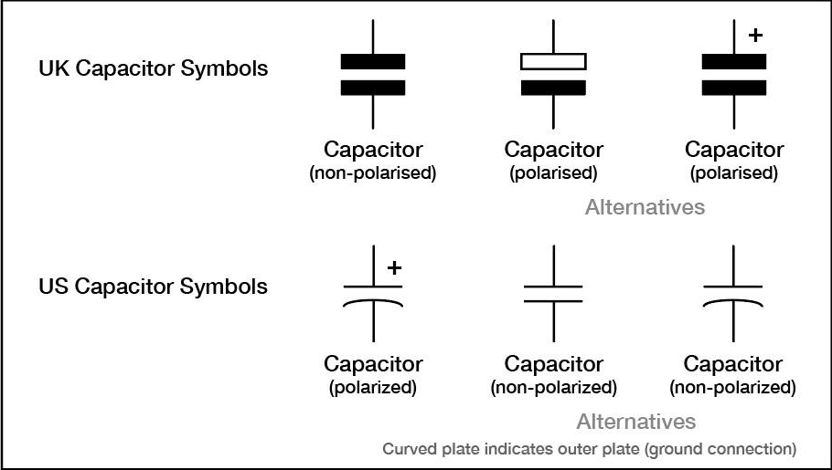
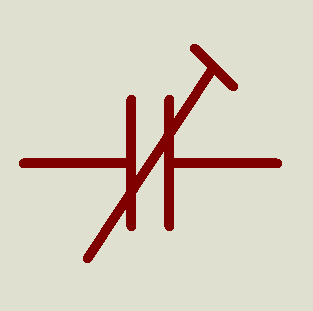
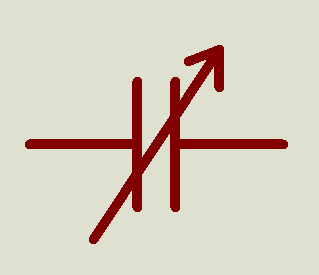

# Device

## Capacitor

|device|desciption|
|-|-|
|CAP|Generic non-electrolytic capacitor|
|CAP-ELEC|Generic electrolytic capacitor|
|CAP-POL|Polarized capacitor|
|CAP-PRE|Preset capacitor|
|CAP-VAR|Variable capacitor|

## 1. CAP
- Đây là tụ thường, không phân cực.
- Đặc điểm
    - Không có chân + - (Có thể cắm chiều nào cũng được)
- Thực tế thường là: Tụ gốm, Tụ film, Tụ mica
## 2. CAP-ELEC
- Đây là tụ điện phân (tụ hóa).
- Đặc điểm: 
    - Có cực + và -
    - Nếu nối ngược cực:
        - ngoài đời có thể nóng hoặc nổ
        - trong mô phỏng có thể lỗi

## 3. CAP-POL
- Đây là tụ phân cực tổng quát.
- Khác gì CAP-ELEC?
    - CAP-ELEC: đại diện rõ cho tụ hóa
    - CAP-POL: chỉ nói rằng tụ có phân cực không nhất thiết là tụ hóa

## 4. CAP-PRE
- Tụ chỉnh trước (trimmer capacitor).
- Đặc điểm
    - Điều chỉnh bằng tua vít
    - Thường chỉnh một lần rồi để nguyên
    

## 5. CAP-VAR
- Tụ biến dung.
- Đặc điểm
    - Thay đổi điện dung liên tục
    - Có thể xoay núm

